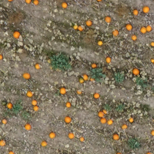
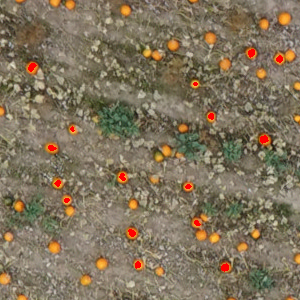
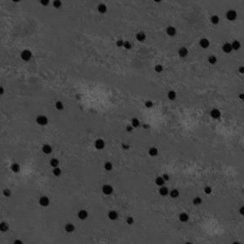
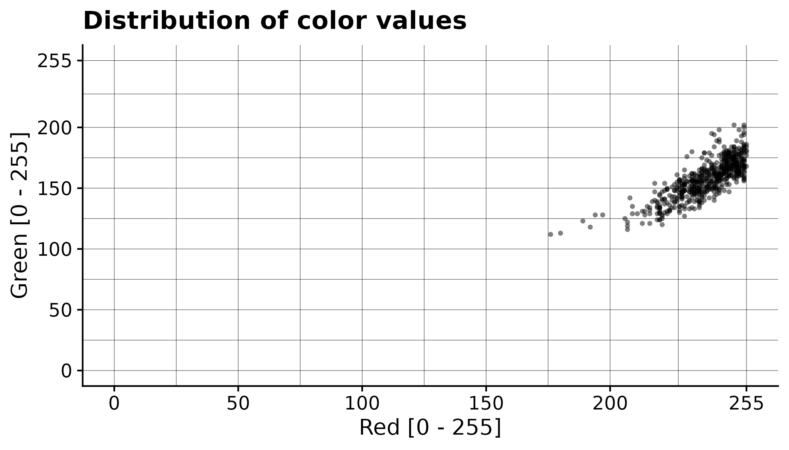
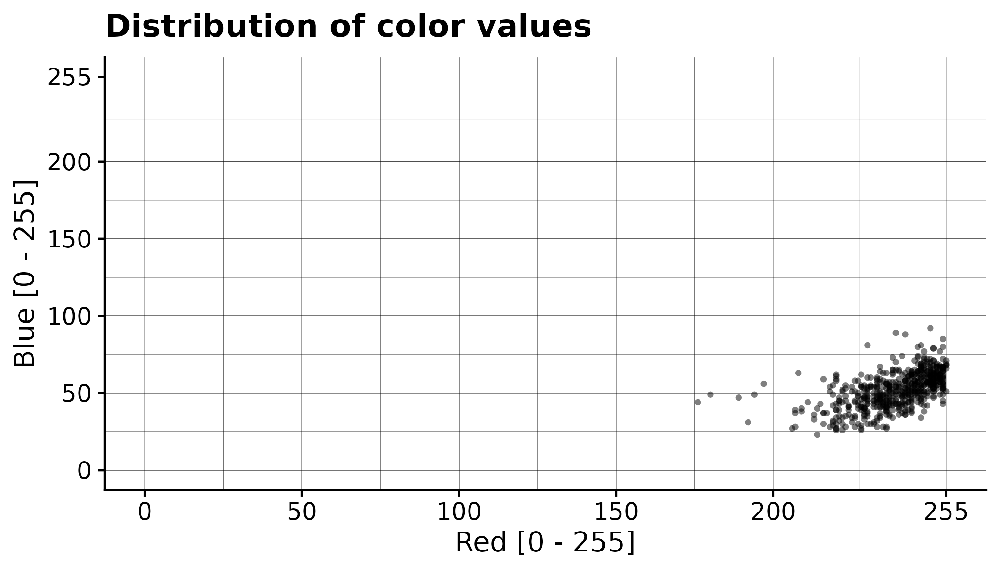

# Tutorial - Segment pumpkins in RGB orthomosaic

An example dataset for the **Orthomosaic Color Distance Calculator** can be downloaded from zenodo on this link:
- https://zenodo.org/record/8254412

The example dataset is from a pumpkin field, where the orange pumpkins can be seen on a gray background. ave the example dataset in an easy to reach location on your computer, for this tutorial I have placed it in the following directory: `/home/hemi/example_dataset`.

The dataset consist of the following files
- an orthomosaic from a pumpkin field with orange pumpkins on a brown / green field **20190920_pumpkins_field_101_and_109-cropped.tif**
- a crop of the orthomosaic **crop_from_orthomosaic.tif**
- an annotated copy of the cropped orthomosaic **crop_from_orthomosaic_annotated.tif**

To learn the color distribution, the information from the **ccrop_from_orthomosaic.tif** file is combined with the annotations in the **crop_from_orthomosaic_annotated.tif** file. 

The **crop_from_orthomosaic.tif** looks as follows: 



The **crop_from_orthomosaic_annotated.tif** looks as follows: 



Install the **Orthomosaic Color Distance Calculator** by running these commands on the command line.
```bash
git clone https://github.com/henrikmidtiby/orthomosaic-color-distance-calculator.git
cd orthomosaic-color-distance-calculator
pipenv install
```

To create a color model from the **crop_from_orthomosaic.tif** and the **crop_from_orthomosaic_annotated.tif** files and use that color model to calculate color distances in the orthomosaic **20190920_pumpkins_field_101_and_109-cropped.tif**, use the following command.
```bash
$ cd orthomosaic-color-distance-calculator
$ pipenv run python color_based_segmenter.py /home/hemi/example_dataset/20190920_pumpkins_field_101_and_109-cropped.tif /home/hemi/example_dataset/crop_from_orthomosaic.tif /home/hemi/example_dataset/crop_from_orthomosaic_annotated.tif --output_tile_location pumpkins/tiles/mahal
Number of annotated pixels: (3, 578)
Writing pixel values to the file "pixel_values.csv"
Average color value of annotated pixels
[ 52.1349481  158.08823529 239.07958478]
Covariance matrix of the annotated pixels
[[134.50515433 137.97940667  78.29253447]
 [137.97940667 253.61611785 153.76939545]
 [ 78.29253447 153.76939545 145.3870695 ]]
100%|█████████████████| 99/99 [04:02<00:00,  2.45s/it]
```
The generated output is a set of map tiles, that contain the calculated distances to the reference color. The tiles can be found in the `pumpkins/tiles` directory. The final step is to combine the tiles into a single orthomosaic, which is done using the **gdal_merge.py** tool on the command line as follows. 
```bash
$ cd pumpkins
$ gdal_merge.py -o pumpkins/colordistance.tif -a_nodata 255 pumpkins/tiles/mahal*.tiff
0...10...20...30...40...50...60...70...80...90...100 - done.
```
You now have a single georeferenced orthomosaic with the calculated color distance. Here is a small part of the orthomosaic shown, right below is the same area in the input orthomosaic.




In addition to generating the processed tiles, the **Orthomosaic Segmenter** also have exported a file **pixel_values.csv** that contains all the color values of the annotated pixels. This can be used to gain a better understanding of the segmentation process. Each row corresponds to the color value of one pixel.
```
b	g	r
23	128	214
35	131	223
39	130	220
27	134	220
...
```

Here the values from the example have been plotted




# Next step
Read about the algorithm used for calculating the distance from all pixels in the orthomosaic to the reference color obtained from the annotation.
* [Reference - Calculating distances to reference color](Reference_Calculating_distances_to_reference_color.md)